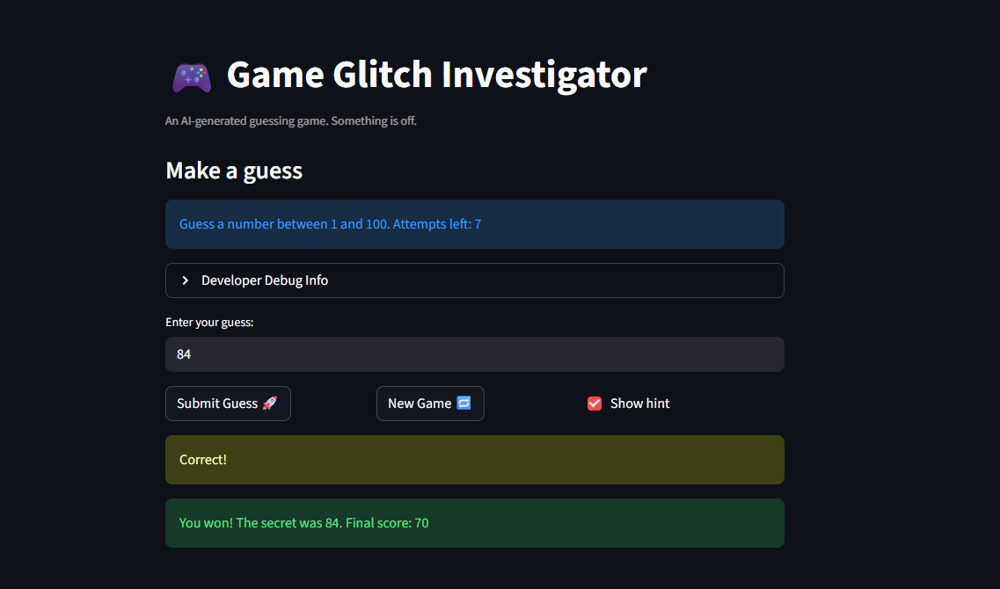
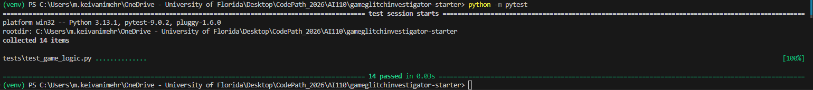

# 🎮 Game Glitch Investigator: The Impossible Guesser

## 🚨 The Situation

You asked an AI to build a simple "Number Guessing Game" using Streamlit.
It wrote the code, ran away, and now the game is unplayable. 

- You can't win.
- The hints lie to you.
- The secret number seems to have commitment issues.

## 🛠️ Setup

1. Install dependencies: `pip install -r requirements.txt`
2. Run the broken app: `python -m streamlit run app.py`

## 🕵️‍♂️ Your Mission

1. **Play the game.** Open the "Developer Debug Info" tab in the app to see the secret number. Try to win.
2. **Find the State Bug.** Why does the secret number change every time you click "Submit"? Ask ChatGPT: *"How do I keep a variable from resetting in Streamlit when I click a button?"*
3. **Fix the Logic.** The hints ("Higher/Lower") are wrong. Fix them.
4. **Refactor & Test.** - Move the logic into `logic_utils.py`.
   - Run `pytest` in your terminal.
   - Keep fixing until all tests pass!

## 📝 Document Your Experience

- **Game’s purpose:** The project is a Streamlit number-guessing game where the player tries to guess a secret number and receives hints such as “Too High” or “Too Low” until they find the correct answer.

- **Bugs I found:** I found that the hint logic could give incorrect high/low behavior, the core game logic was duplicated inside app.py instead of being separated cleanly, and the game had issues caused by inconsistent handling of the secret value during guess checking. Also, it wasnt able to match the inital state and had a problem to cast to str on even attempts. 

- **Fixes I applied:** I refactored the core logic functions (check_guess, parse_guess, get_range_for_difficulty, and update_score) into logic_utils.py, updated app.py to import and use those functions, and fixed the guess comparison flow so the secret value is passed correctly and the game returns the proper "Too High" and "Too Low" hints. I also verified the repair by running pytest and testing the app manually in Streamlit. Additionally, I fixed the inverted hint messages in check_guess (it was returning "Go HIGHER!" when the guess was too high and "Go LOWER!" when too low), corrected the "New Game" button to reset attempts to 1 instead of 0 so it matches the initial game state, and removed the bug that cast the secret number to a string on even-numbered attempts — which caused wrong comparisons since "9" > "10" is True in Python string ordering but False numerically. I also wrote regression tests in tests/test_game_logic.py to cover each of these bugs so they can't silently reappear.

## 📸 Demo

## 🚀 Stretch Features

- [ ] [If you choose to complete Challenge 4, insert a screenshot of your Enhanced Game UI here]
